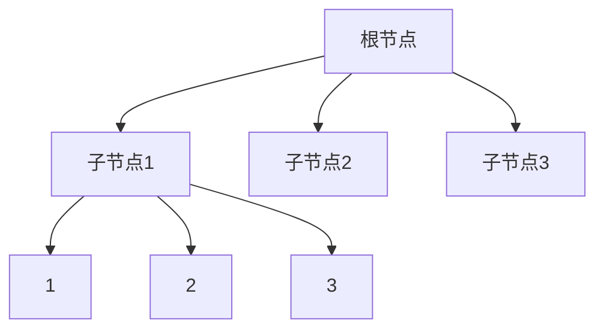

# markdown template

> 记录markdown 的一些常用模板，以备以后需要的时候使用



```mermaid
graph TD
A[根节点]-->B[子节点1]
A-->C[子节点2]
A-->D[子节点3]
B-->E[1]
B-->F[2]
B-->G[3]
```

- TD 为竖向，LR为横向

```
graph TD
A[根节点]-->B[子节点1]
A-->C[子节点2]
A-->D[子节点3]
B-->E[1]
B-->F[2]
B-->G[3]
```

