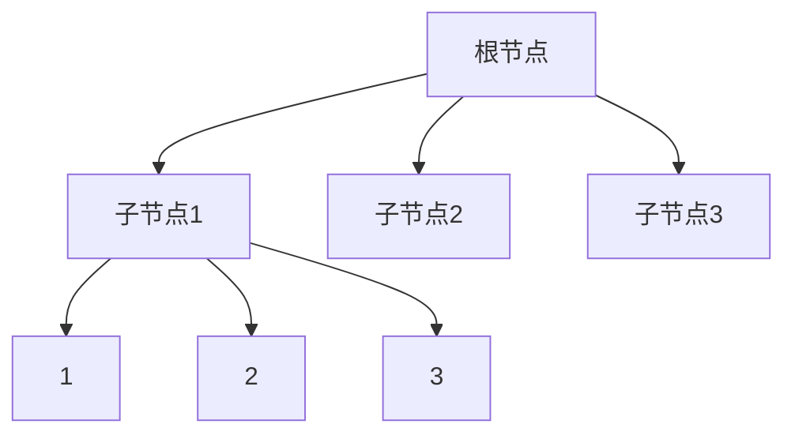

# markdown template

> 记录markdown 的一些常用模板，以备以后需要的时候使用




- TD 为竖向，LR为横向

```
graph TD
A[根节点]-->B[子节点1]
A-->C[子节点2]
A-->D[子节点3]
B-->E[1]
B-->F[2]
B-->G[3]
```


![pic1][pic1]

![pic2][]

[pic1]: http://eddyzhou.gitee.io/picture-bed/202101/AeAzbU.png	"Gitee 地址"
[pic2]: https://raw.githubusercontent.com/eddie-zhou-yi/picture-bed/master/images/202101/20210420193256.png	"GitHub 地址"

